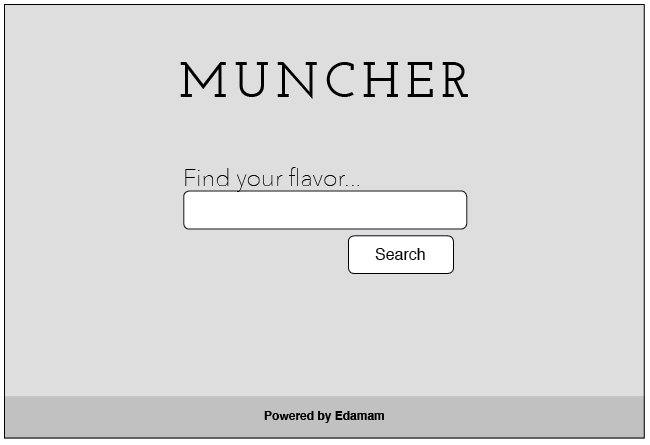
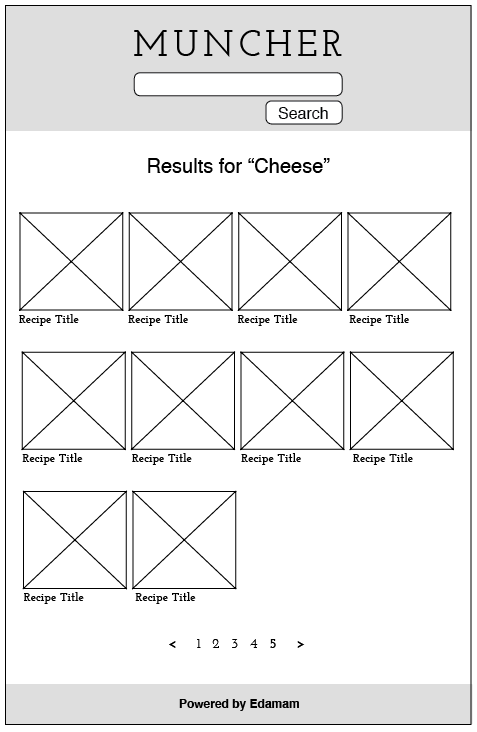
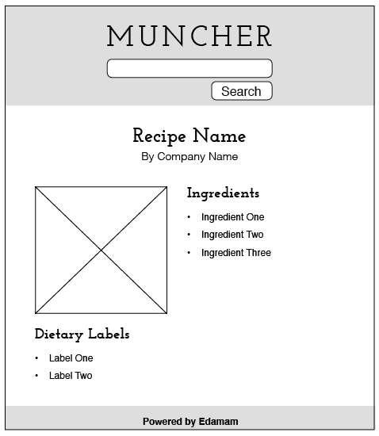

# Recipe API Consumer

## Purpose
Create a web application that will display recipes based on a search term. We will utilize an API from Edamam called the [Recipe Search API](https://developer.edamam.com/edamam-recipe-api).

This project will require some research into techniques we have not taught in class.

This is an individual, [stage 2](https://github.com/Ada-Developers-Academy/pedagogy/blob/master/rule-of-three.md) project.

## Learning Goals:
- Configure an API for consumption
- Create authenticated API requests using HTTParty
- Consume JSON responses from an API
- Map response to application-specific data
- Separate API logic from application logic

### Baseline
Before you start writing _any_ code:

- Explore the API documentation to become familiar with the request(s) you can make
- Create a Trello Board listing the features you will need to add and use it to track the progress of your app.

Once you've explored the API docs, this project:

- requires you to create a Rails application
  - conform to Rails conventions on naming and inflection
  - by using `rails new .` you will create a new rails app _inside_ of the fork folder instead of creating a _new_ folder for your rails app
- Use better_errors for debugging purposes
- Deploy your completed app to Heroku

### Detailed Requirements  
**Search**:  
- The user shall type in a search term that will:
  - Make a request to the API using the search term
  - Display the results in a list to the user

**List View**:  
- This shall show a **paged** list of recipes for a given search term, _ten at a time_
  - Pagination of the recipies is a feature you will need to research including a concept called query parameters.
- This view shall show the name of the recipe and the corresponding photo
- The view shall have a link from the recipe to a recipe show view

**Show View**:  
- This shall show the details about a given recipe. These details include:
  - Name
  - Link to the original recipe (opens in a new tab)
  - Ingredients
  - Dietary information

**Additional Requirements**:  
- One of the things that permits us to use this API, it providing attribution to the API's created. We must provide this somewhere on our site. Example locations include the footer or an about page.
  - [Examples from the API site](./images/attribution.png)
- You must also create tests for your API Wrapper & any classes as well as controller tests using VCR
- Your site must have a responsive design, must be usable on mobile devices, and must use semantic HTML

### Important Notes:
- Using this API as a developer limits the number of API calls in a month to 5000. This means that we must try to minimize API calls for testing purposes as much as possible, to ensure you do not exceed this number of API calls in the one week of development we have.

### Optionals:
- Keep track of most recent search terms and allow user's to return to those searches
- Implement an OAuth strategy using Google
  - Allow users to save recipes to a "favorites" section that they can return to
-  Provide checkboxes or other controls to limit the search to options such as:
	-  Peanut Free
	-  Soy Free
	-  High Protein
	-  Etc

### Optional Wireframes:
You have creative control over the design and layout of this project. Below are optional wireframes you may use. It is not a requirement that you do.

**Homepage:**

  

  **Results Page:**

  

  **Recipe Show Page:**

  

Reminder: Make sure all content is still easy to read when the width of a screen is shrunk. Use flexible measurements like width and REM.

These should be responsive. When the screen width shrinks to a medium screen, have a row with only two recipes. On a small screen width, have only a single recipe per line.  

## What We're Looking For

Check the [feedback template](./feedback.md) to see how we will evaluate your project.

This project is due **Monday May 7th**
